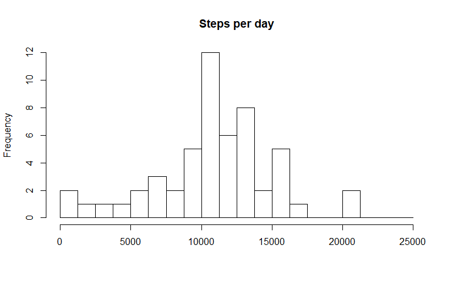
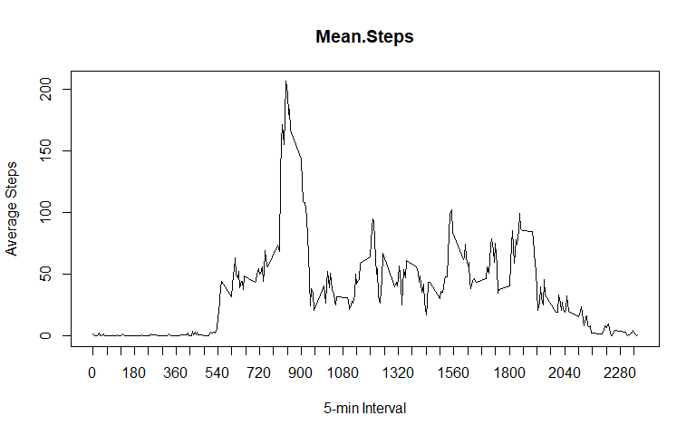
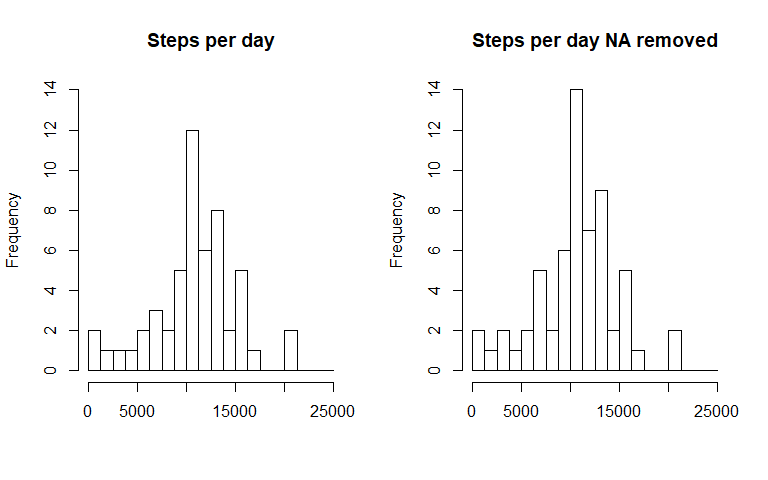
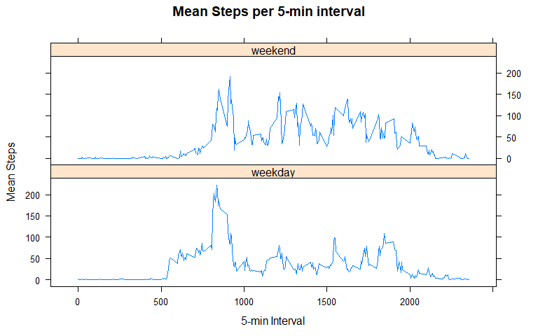

##Packages Installed


```
## Loading required package: plyr
```

```
## Loading required package: dplyr
```

```
## 
## Attaching package: 'dplyr'
```

```
## The following objects are masked from 'package:plyr':
## 
##     arrange, count, desc, failwith, id, mutate, rename, summarise,
##     summarize
```

```
## The following objects are masked from 'package:stats':
## 
##     filter, lag
```

```
## The following objects are masked from 'package:base':
## 
##     intersect, setdiff, setequal, union
```

```
## Loading required package: zoo
```

```
## 
## Attaching package: 'zoo'
```

```
## The following objects are masked from 'package:base':
## 
##     as.Date, as.Date.numeric
```

```
## Loading required package: lubridate
```

```
## 
## Attaching package: 'lubridate'
```

```
## The following object is masked from 'package:plyr':
## 
##     here
```

```
## The following object is masked from 'package:base':
## 
##     date
```

```
## Loading required package: lattice
```


## Loading and preprocessing the data

Data was loaded using following code.


```r
rawData <- read.csv("activity.csv")
```


## What is mean total number of steps taken per day?

Steps per day was calculated using the following code:


```r
stepsPerDay <- aggregate(x = rawData$steps,
                           by = list(rawData$date), sum)
colnames(stepsPerDay) <- c("date","steps.per.day")
```

The historgram below shows the distribution:


```r
hist(stepsPerDay$steps.per.day, breaks = seq(from = 0, to = 25000, by = 1250), 
     xlab = "", main = "Steps per day")
```

<!-- -->

The median steps per day was 10765.

The mean steps per day was 10766.2


```r
median(stepsPerDay$steps.per.day, na.rm = TRUE)
```

```
## [1] 10765
```

```r
mean(stepsPerDay$steps.per.day, na.rm = TRUE)
```

```
## [1] 10766.19
```


## What is the average daily activity pattern?

The following code was used  to find the average steps per interval.


```r
meanStepsInterval <- aggregate(x = rawData$steps,
                         by = list(rawData$interval), mean, na.rm = TRUE)
colnames(meanStepsInterval ) <- c("interval","mean.steps.per.interval")

plot(y = meanStepsInterval $mean.steps, x= meanStepsInterval $interval, type = "l", 
     xaxt = "n", xlab = "5-min Interval", ylab = "Average Steps", main = "Mean.Steps")

axis(side = 1, at = c(seq(from = 0, to = 2355, by = 60)))
```

<!-- -->

The following code was used to find the interval with the maximum steps per interval.


```r
MaxmeanStepsInterval <- match(max(meanStepsInterval $mean.steps),
                                meanStepsInterval $mean.steps)

meanStepsInterval$interval[MaxmeanStepsInterval]
```

```
## [1] 835
```

The interval with the highest average steps was 835.


## Imputing missing values


```r
length(rawData$steps[is.na(rawData$steps)])
```

```
## [1] 2304
```

There are 2304 NA intervals.

A new dataset was created by replacing the first day of NA values with the average steps per interval.
The other NAs are replaced by interpolating values from the same interval of the prior and following day using zoo::na.approx.
Here is the code:


```r
replacedNA <- rawData
replacedNA$steps[1:288] <- meanStepsInterval $mean.steps.per.interval 

replacedNA <- ddply(replacedNA, .(interval), transform, steps=na.approx(steps, rule=2))
replacedNA <- replacedNA[order(replacedNA$date,replacedNA$interval), ]

stepsPerDayNAremoved <- aggregate(x = replacedNA$steps,
                         by = list(replacedNA$date), sum)
colnames(stepsPerDayNAremoved) <- c("date","steps.per.day")
```

The following code was used to create the plots below:

```r
par(mfrow= c(1,2))

hist(stepsPerDay$steps.per.day, breaks = seq(from = 0, to = 25000, by = 1250), 
     xlab = "", main = "Steps per day", ylim = c(0,14))

hist(stepsPerDayNAremoved$steps.per.day, 
     breaks = seq(from = 0, to = 25000, by = 1250), xlab = "", 
     main = "Steps per day NA removed", ylim = c(0,14))
```

<!-- -->

The plots are very similar in distribution and the NA-replaced dataset has mainly increased values in the middle of the distribution.

The follow code was used to recalculate the median and mean with the NAs substitued with interpolated values:


```r
median(stepsPerDay$steps.per.day, na.rm = TRUE)
```

```
## [1] 10765
```

```r
round(mean(stepsPerDay$steps.per.day, na.rm = TRUE),1)
```

```
## [1] 10766.2
```

The median for the NA subsituted dataset is 10765.

The mean for the NA subsituted dataset is 10766.2.  

This mean and median is nearly identical to the original dataset with NA values.


##Are there differences in activity patterns between weekdays and weekends?

Using the following code I created a new factor variable with two factors ("weekdays" and "weekends") in the NA-replaced dataset.


```r
replacedNA$date <- ymd(replacedNA$date)


weekday.weekend.data <- replacedNA %>%
        mutate(weekday.weekend = ifelse((weekdays(date) == "Saturday")
                                        | (weekdays(date) == "Sunday"),
                                        "weekend", "weekday"))

weekday.weekend.data <- aggregate(x = weekday.weekend.data$steps,
                                  by = list(weekday.weekend.data$interval, 
                                            weekday.weekend.data$weekday.weekend), 
                                  mean, na.rm = TRUE)
colnames(weekday.weekend.data) <- c("interval", "weekday.weekend",
                                      "mean.steps.per.interval")
```
The panel plot below shows the difference between the average steps per interval for weekdays and weekends.


```r
print(xyplot(mean.steps.per.interval ~ interval | factor(weekday.weekend), 
       data=weekday.weekend.data, type = 'l', layout = c(1,2),
       xlab = '5-min Interval', ylab = 'Mean Steps', 
       main = "Mean Steps per 5-min interval"))
```

<!-- -->
